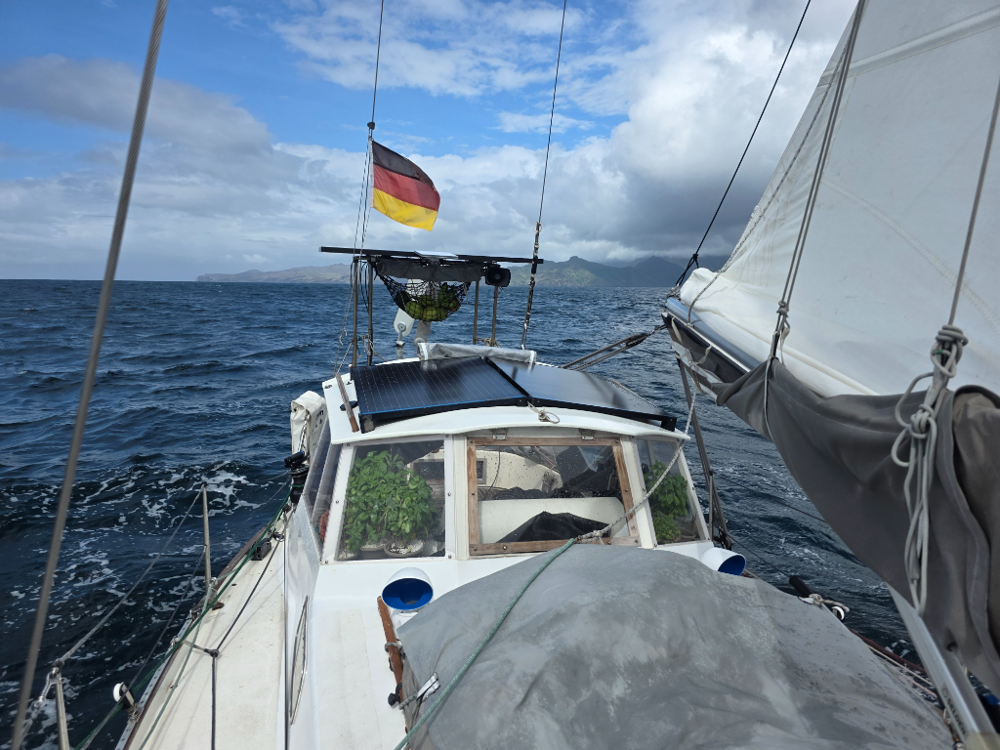

Exploring the islands of Marquesas has been fun. But it is time to go find something new, the atolls. We are heading to the next island group called Tuamotus. At noon we had the boat ready to go. Every nook and cranny full of vegetables and fruits bought from a local who sells the surplus of his garden to us cruisers. 

After anchor was stowed away, we readied the staysail and hoisted the main. Seeing a squall behind the peninsula, we set 1st reef and motored until it passed. Then we enjoyed a fast downwind run on the north side of the island. Soon after gybing we found the wind shadow and turned the engine on again. At sundown we were greeted by a pod of dolphins and hope for the wind to find us soon.

* Distance today: 26.5NM
* Lunch: lentil sweet potato soup
* Engine hours: 2.3