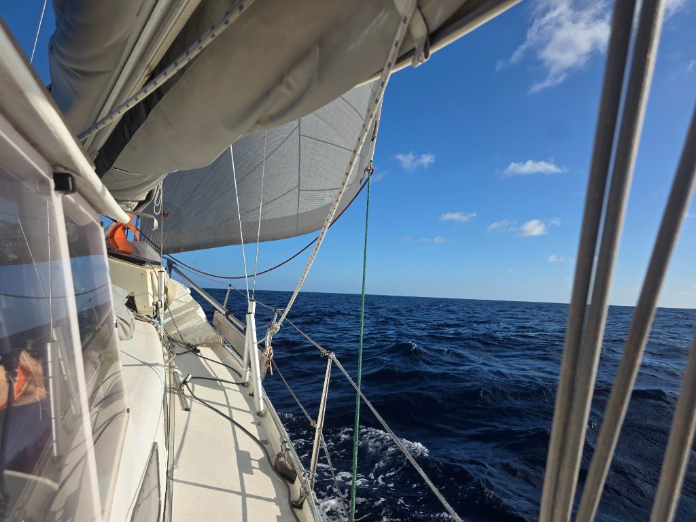

As we got out of Nuku Hiva's shadow, the wind filled in and we could start sailing on a brisk beam reach. Windvane was set, and since we've only had to roll the genoa out or in a bit to adjust to the wind speed.

The night was dark and without a moon. Milky Way stood visible above, and the Southern Cross and Orion guided our way.

After some light morning rain, the wind settled into a steady 13-15kn, allowing for fast and relatively easy progress aided by a favourable current. We hope not to sail too fast, as there is a calm to the south of us that should vanish around the time we get there.

* Distance today: 133NM
* Lunch: spaghetti aglio e olio
* Engine hours: 0
