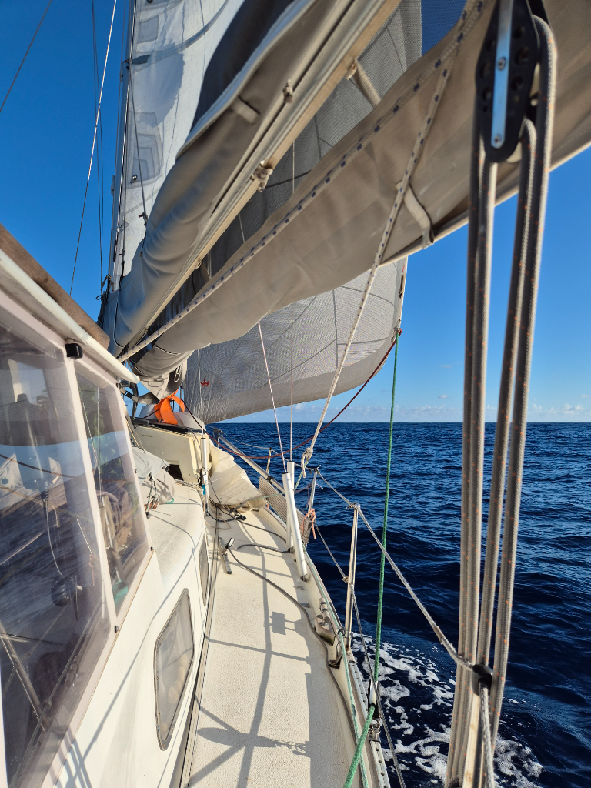

After the night, it was time to hoist the main fully up. It has been a while since we have had the full main and genoa out. The conditions at sea are absolute bliss! The waves are small, the swell calm and the wind on the beam keeps the boat steady. We are edging closer to the calm patch but it should fill in over the night giving us nice steady conditions for the whole way. 

* Distance today: 120NM
* Lunch: tofu curry
* Engine hours: 0
