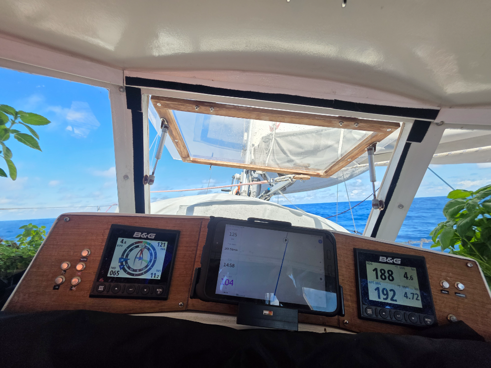

The light and easy conditions continued as we sailed past the Isles of Disappointment, aptly named for their lack of anchorages.

As the atolls draw nearer, the boats that chose this weather window from the various Marqusan islands are starting to converge. At the time of writing we have three visible on AIS, one - Norwegian *Alissa* - which actually shows above the horizon.

* Distance today: 98NM
* Lunch: navy bean soup
* Engine hours: 0
