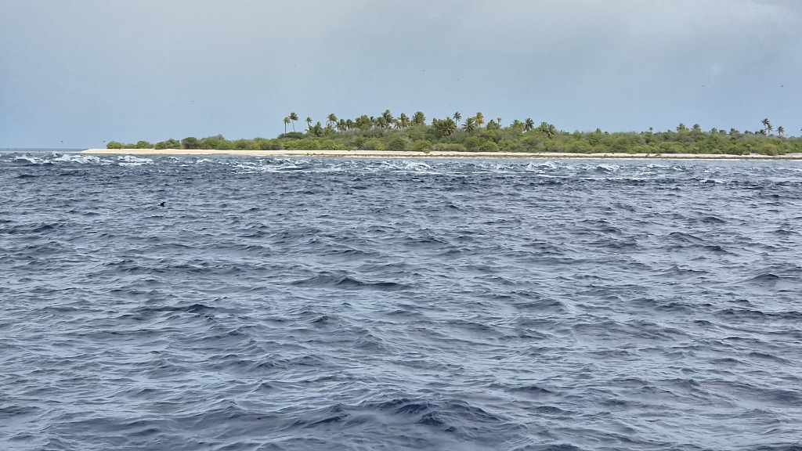

The sea state grew a bit more rumbunctious than before but Lille Ø made decent progress. In the morning we poled out the genoa and continued wing on wing untill our speed dropped a bit too much. If we could keep up 5kn, we still had a chance to make it through the pass with a favorable current. Or so we thought. Timing the entry to an atoll is not an exact sciense. There are no measurement devices around, nor pass schedules provided. The best tool available is Guestimator, and that gets it wrong on many occasions. The things to consider are: tide, wind, waves, amount of passes, pass widths, size of the atoll. All these components affect the in and outgoing current and when they occur. 

Guestimator had the slack tide at 1pm. The boats going through reported 5 to 6 knots of current at that time, we came in at 14:30 when guestimator had given 2kn of incoming current, in reality we had 4kn against. Luckily this is a wide pass with buoys marking the best path through. After the pass we motored through the uncharted waters of the atoll and dropped our anchor into 4 meters of crystal clear water and floated the anchor with couple of floaties to keep it away from the choral bommies. 

Raroia is gorgeus. Well spend here a while soaking up all the different shades of blue.

* Distance today: 108NM
* Lunch: bananas
* Engine hours: 5.5
