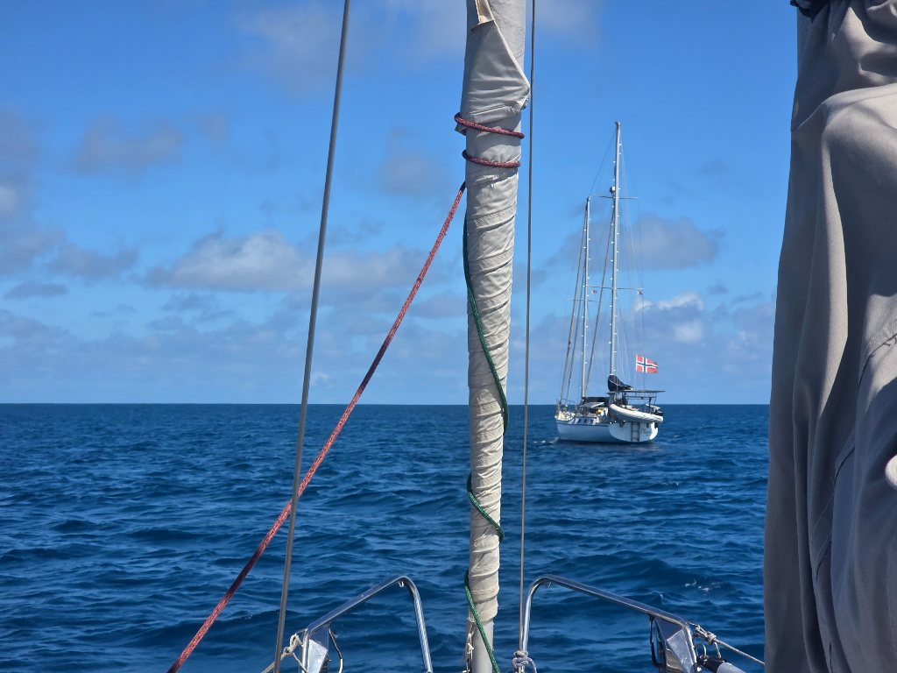
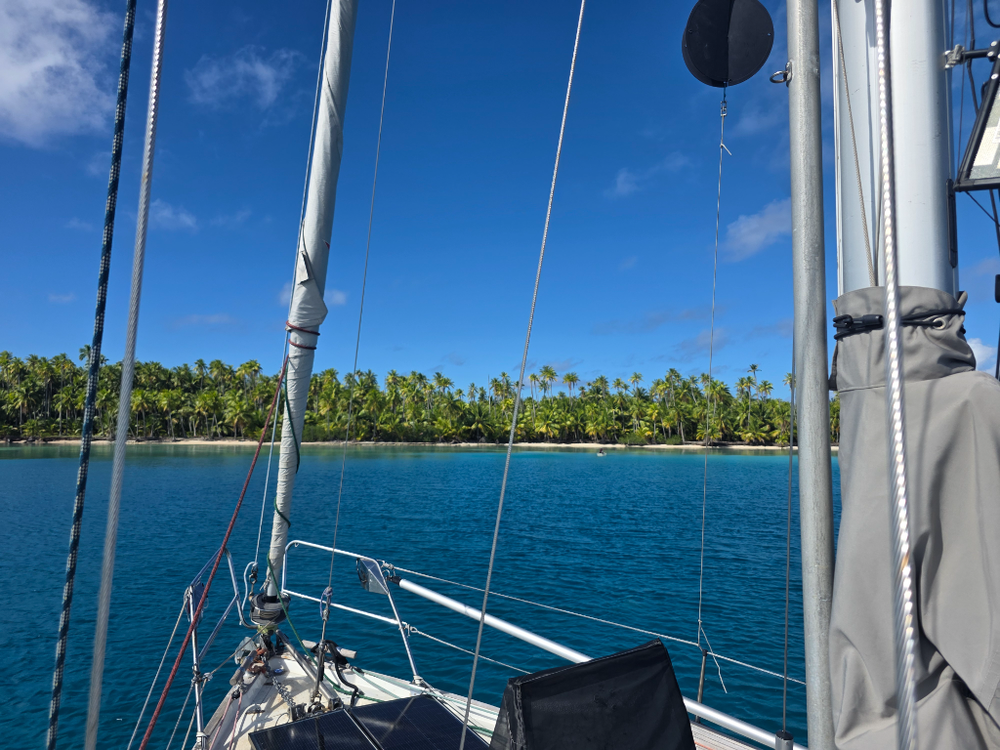

The Raroia northeast anchorage was very comfortable, and the facilities of the "Twin Palms Yacht Club" fun. But we still wanted to explore the rest of the atoll.

And so in the morning we hoisted anchor and followed *Plan B* on a slaloming motoring course between the coral bommies.

Now we are anchored next to an abandoned pearl farm, and very near the spot where Kon-Tiki did their crash landing after the Pacific crossing in 1947.

* Distance today: 10.9NM
* Lunch: not yet
* Engine hours: 2.7
