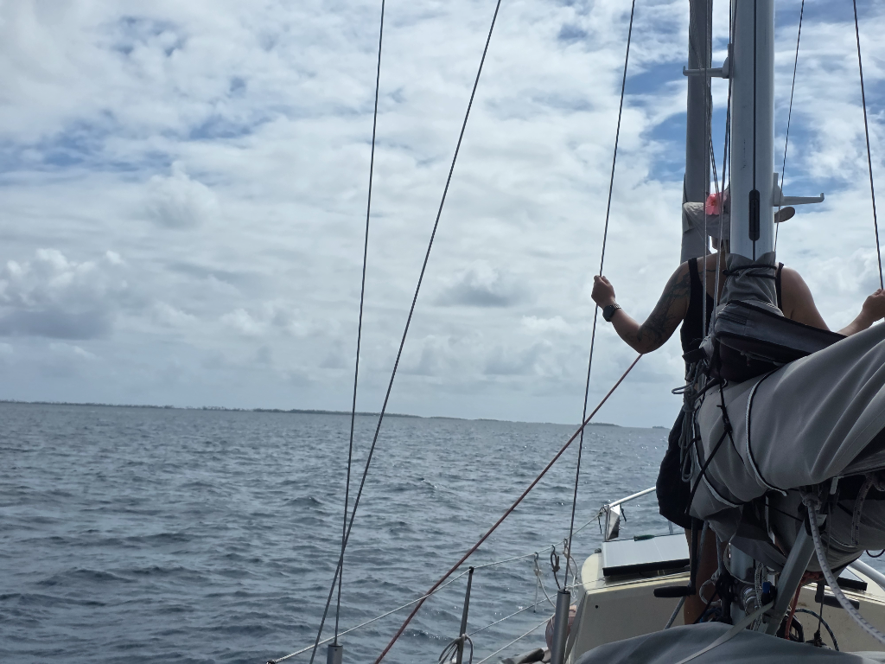

Anchor got up slightly after planned departure time, but it came up easily. The pearl floats make hoisting anchor by hand lighter. Then we started motoring to the other side of the atoll.

We needed to keep a extremely vigilant lookout, as the Raroia East anchorage has a lot of unused pearl farm ropes and floats partially submerged around it. On many occasions we needed to turn the engine on neutral and hope we glide over the ropes without getting tangled. In this kind of a place a full keel is a good keel form as the likelyhood of getting caught by the derelict ropes is smaller. 

We anchored in close proximity to the pier, but the supply ship for this month already did its visit last week. We are going for dinner on land with one of the local families.

* Distance today: 7NM
* Lunch: wraps with hummus
* Engine hours: 1.9
