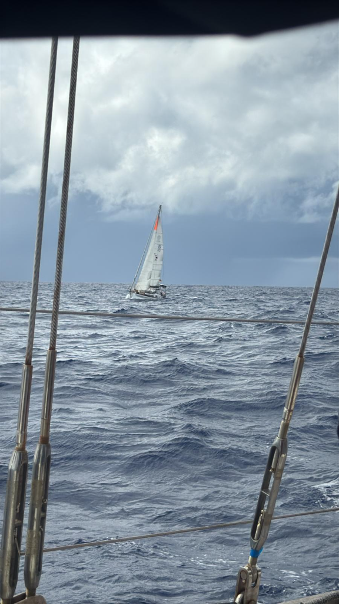
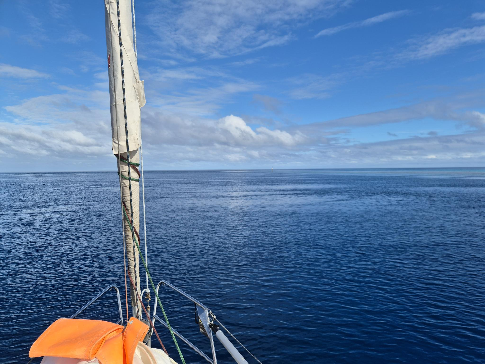

There are passages that are easy, and there are passages that are nice. This was neither.
We were supposed to sail on beam reach from Raroia to Makemo, following a gentle curve of a backing wind.

With this plan, we timed ourselves to slack water at the pass. And indeed there was no current, but as a sign of things to come, quite big and sharp waves that carried through the pass.

We exited together with *Plan B*. We were hobbyhorsing quite badly in the swell, and soon they overtook us and headed for the horizon.

Wind turned way earlier than anticipated, and what followed was a tough beat into big waves and quite changing winds. At times we were making comfortable progress with 60° wind angle and 15kn of wind, and other times we were bobbing about with no wind.

And then there were the squalls. 33kn, 36kn, and the last one taking the crown at 45kn. With sails up, the best option was to run with these, losing an hour or two of progress in just minutes. After the last squall, the wind died and we had to motor in. At least we timed the pass correctly and had a totally smooth ride in with 1.5kn of favourable current.

* Distance today: 94NM
* Lunch: lentil turnip curry
* Engine hours: 8.4
