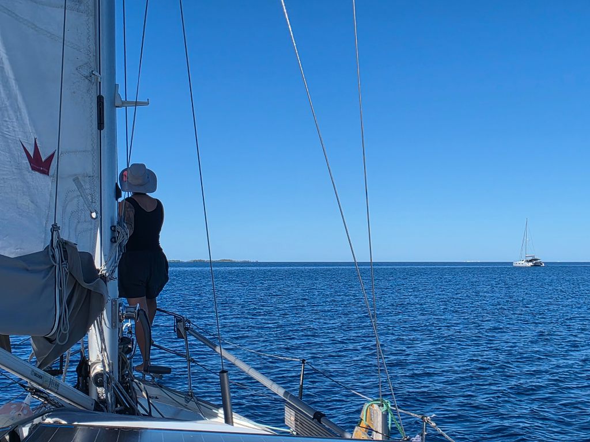

In the morning we completed the boat's provisioning by rowing to get some fresh croissants from the village bakery. Then we waited for the sun to move to a better angle and hoisted anchor.

Soon we were able to fly full sail, and ghost along the still atoll on a gentle breeze. Sun was high and behind us, making bommie avoidance easy. And with this wind direction, the sails provided a nice shade for the lookout.

Now we are anchored in the east end of the Makemo atoll. Water is very clear here, and there are many reefs to explore. But first we'll have to wait out some higher winds over the next two days.

* Distance today: 10NM
* Lunch: melanzanchini
* Engine hours: 1.4
