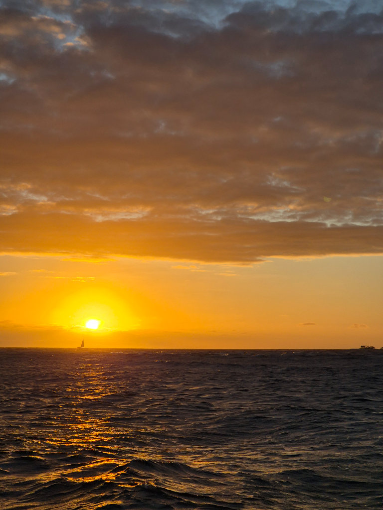

After several windy days, we knew the pass would be in a 24/7 ebb. Constant outgoing current means that you can only choose how fast you are being shot out of the pass. So based on available information we decided that at 2pm we should be ready at the pass.

We hoisted the anchor around noon. It was a bit of a workout as it had dug itself deep into the white sand. We motored through the atoll and were greeted by two other boats on their way out. It is always nice when someone else has come to the same conclusion of the best pass timing as you. We watched *Windhorse II* and *Plan B* go out with approximate 4kn  current, so with *Plan B* 0.7NM away and nearly through, we stepped into the conveyor belt of the pass and made our speedy way through. No significant standing waves were present, so after the pass we hoisted the main in 1st reef and poled out the staysail and were on our way!

In the darkness we gybed and continued on a fast beam reach till midnight watch change. At that point it was time to try and slow down, so we put in a second reef. That wasn't quite enough, so at 3am and 5NM to the pass we hove to and waited for light. It was pleasant to see the boat drift at about 1kn slowly towards our destination, bow staying at about 50° AWA, and the turbulent slick left by our keel calming the breakers.

About a half hour before sunrise we eased the tiller and sheets, and continued our way towards the pass with just the reefed mainsail. Just at sunrise we slipped through with 2.5 to 3kn counter-current.

Powered by the mainsail and engine we made it through quick and smooth. Inside the atoll we packed in the sail and dug the anchor from the chain locker and dropped the hook. It was time to sleep and only think of navigating the atoll in the afternoon with the sun high on the sky to see the bommies.

* Distance today: 92NM
* Lunch: lentil-sweet potato stew
* Engine hours: 3.6
