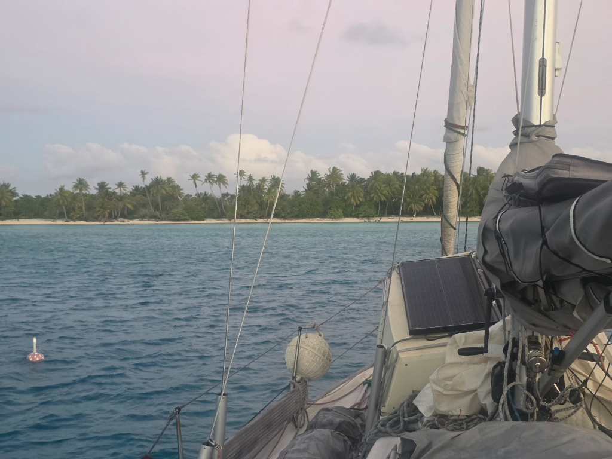

After a nap and coffee the sun was high enough, and we hoisted the anchor.

Wind was slightly down from sunrise, but still in the 20kn range, driving big rolling waves through the 8NM fetch on the atoll. We decided to motorsail to keep the boat moving despite the excessive hobby horsing.

As always, bommie dodging in these uncharted waters was quite challenging, with waves occasionally splashing the lookout standing in the rear of the boat. But it was all worth it, we're again anchored in a gorgeous and protected spot. And getting ready for the Midsummer.

* Distance today: 10NM
* Lunch: spaghetti with homemade pesto
* Engine hours: 3.2