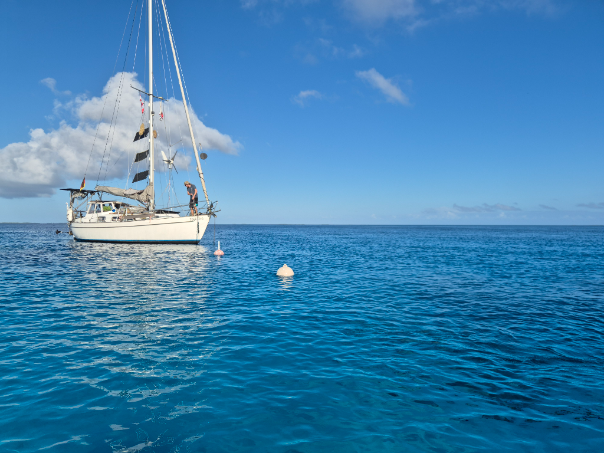

The wind continues to back, so it was again time to move. We spent the morning on boat projects, and then hoisted anchor for a short jump closer to the three atoll passes.

Easy trip in light winds, with barely a bommie in sight. We were able to tuck the boat snugly behind the stream of the tiny Passe Otao. As there are no actually good spots for a 270° wind shift, we hope the tidal stream will smoothen the waves a bit.

After dropping the hook we ensured none of the nearby coral heads come too high, and rowed to see the pass on an incoming tide. Beautiful corals!

* Distance today: 4.3NM
* Lunch: spaghetti aglio e olio
* Engine hours: 1.5
