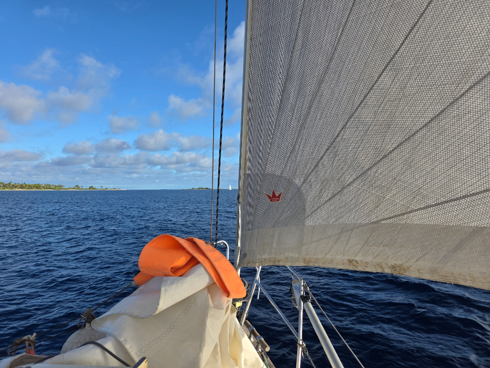
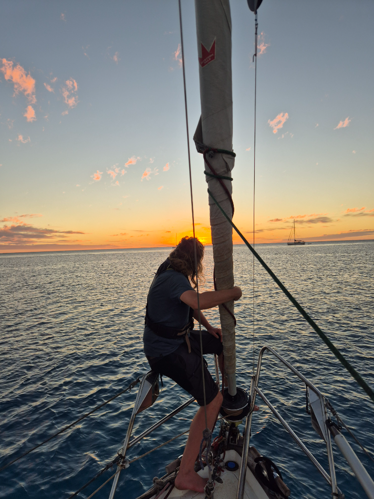

After a rough night, at sunrise we hoisted the anchor. Overnight the wind did a 200 degree shift that turned our of anchorage to a shitty one with a lee shore uncomfortably close. But that is life on the atolls. You have never good coverage for big windshifts. 

After anchor was up, we headed to the pass and went from the tumoltuos sea inside the atoll to the smooth seas of the open ocean. We rolled out the full genoa accompanied by the mainsail and were on our merry way towards Fakarava. In the lee of Tahanea we made good progress. With no waves we were flying towards our destination. 

At midday, we had already done over half of the passage. We might make it in before sunset! As the low slack tide was at 3 and after we would have a gentle current with us. So the only limitation was daylight. So instead of a leisurly overnighter this became an active daysail with constant adjustments to the sails in the variable 10 to 15 kn of wind. 

At 16:45 we were at the pass and after visually confirming the smooth seas in the pass we motored in. At times the 3kn current pushed us in fast and after going around the marked reef we dropped the hook with 10 minutes of daylight left! Our first daysail in Tuamotus!

Tomorrow we shall check the Tumakohua pass by snorkel. It is the home for the world famous 'wall of sharks'!

* Distance today: 54.6NM
* Lunch: sandwitches
* Engine hours:  1.9
