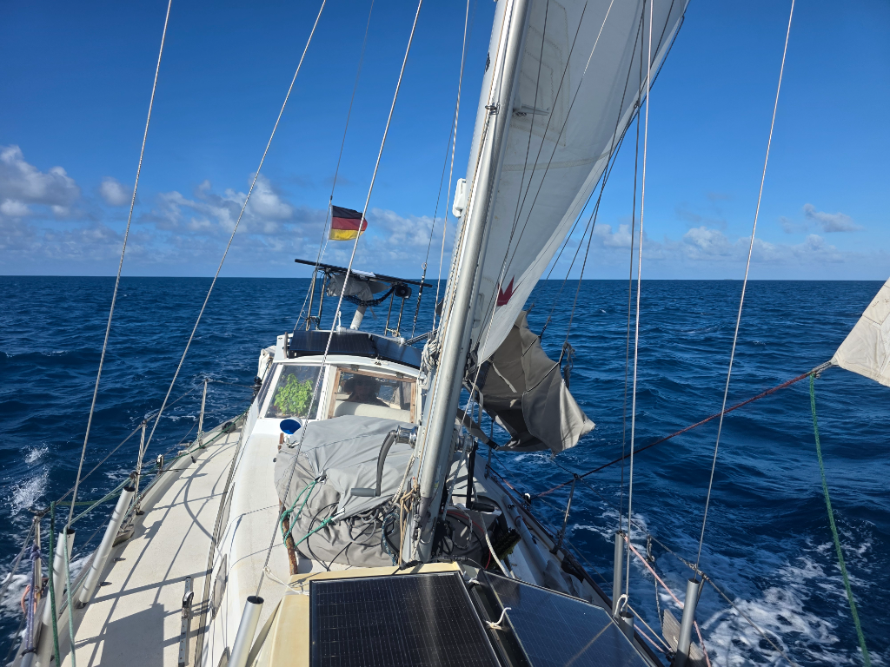

The winds keep rotating, and so one needs to migrate to the right end of the atoll. Especially here. Fakarava has over 30NM of fetch in the wrong conditions. But we had a chance to snorkel the Unesco Nature site Wall of Sharks, and enjoyed a lovely dinner ashore.

And so at sunrise we were again hoisting anchor. What followed was another glorious daysail on a fast beam reach. Unlike most atolls, Fakarava is actually charted and hence one can sail here. In the end we even tacked a bit to get around a pearl farm in lake-like conditions.

The anchorage in front of Rotoava town is deep and full of boats, but we managed to find a good spot. At least for a day or two until wind turns again.

* Distance today: 29NM
* Lunch: not yet
* Engine hours: 0.8
