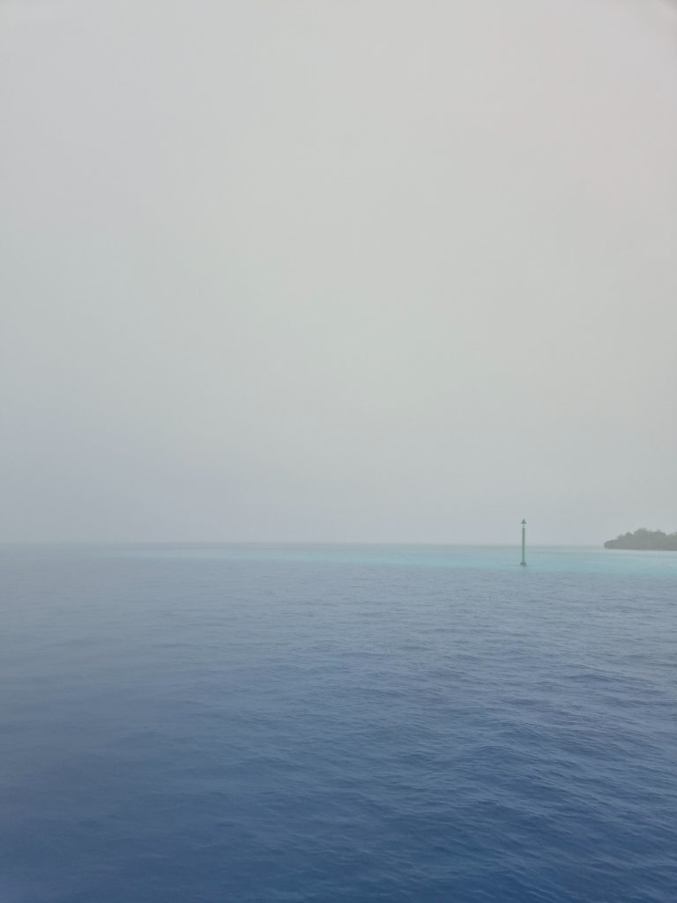

At sunrise we were already outside in the 1kn wind getting the anchor up. After the 360° change in wind, we had a bit of the chain under a rock but we managed to wrangle it out without getting wet. As we were motoring out, the wind picked up a bit and turned southerly, several hours earlier than in the forecast. So we changed our plan. Instead of heading back to the Fakarava south pass, we headed out towards Toau. At least in that direction we had a small chance of sailing.

We hit the pass 45 minutes before slack. The current created a wide band of standing waves in the middle of the pass, but the NE side of the pass was still water, so we motored out. After the pass we hoisted the full main and genoa and had nice sailing wind for about 5 minutes. After that the wind dwindled to near nothing and we motorsailed onwards.

The day was a gray one. It didn't properly rain but you did get wet in just minutes by standing outside. In the lee of the atoll, we enjoyed our calm day of motoring. In the afternoon we spotted the sea markers for the Anse Amyot and went in. What a feeling to just go in! As Anse Amyot is a 'blind pass' that doesn't fully go through, there is no significant current and the reef protects us in 270° around us. Here we are tied to a mooring ball and will wait for the right wind to head towards Tahiti.

* Distance today: 39.5NM
* Lunch: Miisa's cous cous salad
* Engine hours: 7.9
