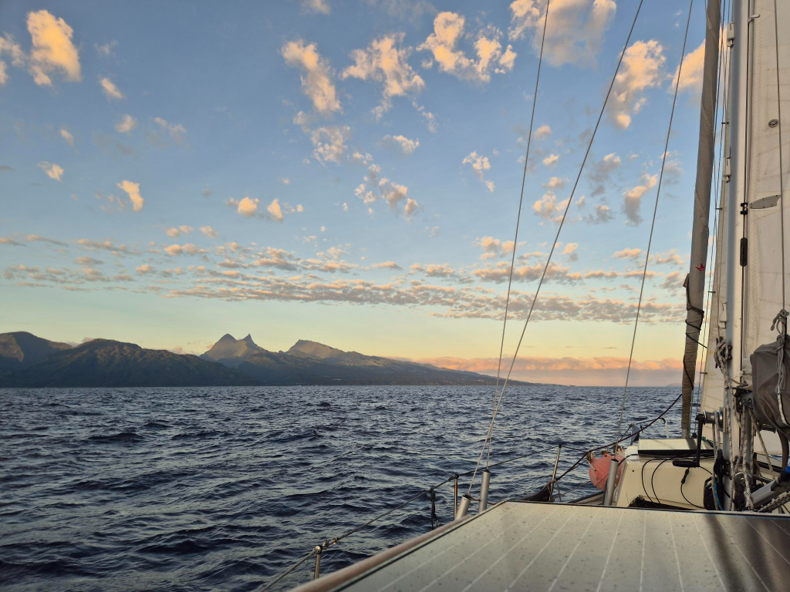
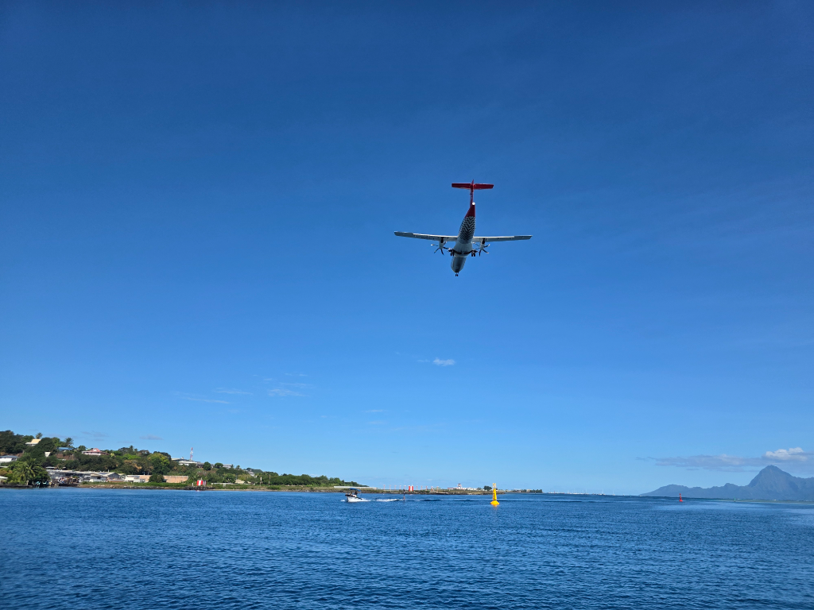

After dinner we could slightly ease our course, trading some of our gained height for comfort. The night skies also cleared, and there was a huge shooting star streaming across the skies in the early hours.

Pretty soon afterwards we started getting some shelter from the island of Tahiti, making for a more comfortable going. Eventually wind also died, and in the morning we had to motor the remaining miles.

We hailed Papeete Port Control on VHF and were given permission to enter ahead of a fast ferry and a Korean fishing boat. Then we had to wait again for permission to cross the airport runway.

The airport anchorage is quite crowded, but we were lucky to find a good spot right behind *Plan B*. Since this anchorage is deep, we're using the extra anchor chain we bought in Panama for the first time.

Next to Carrefour to see a proper grocery store for the first time since February!

* Distance today: 85NM
* Lunch: not yet
* Engine hours: 4
