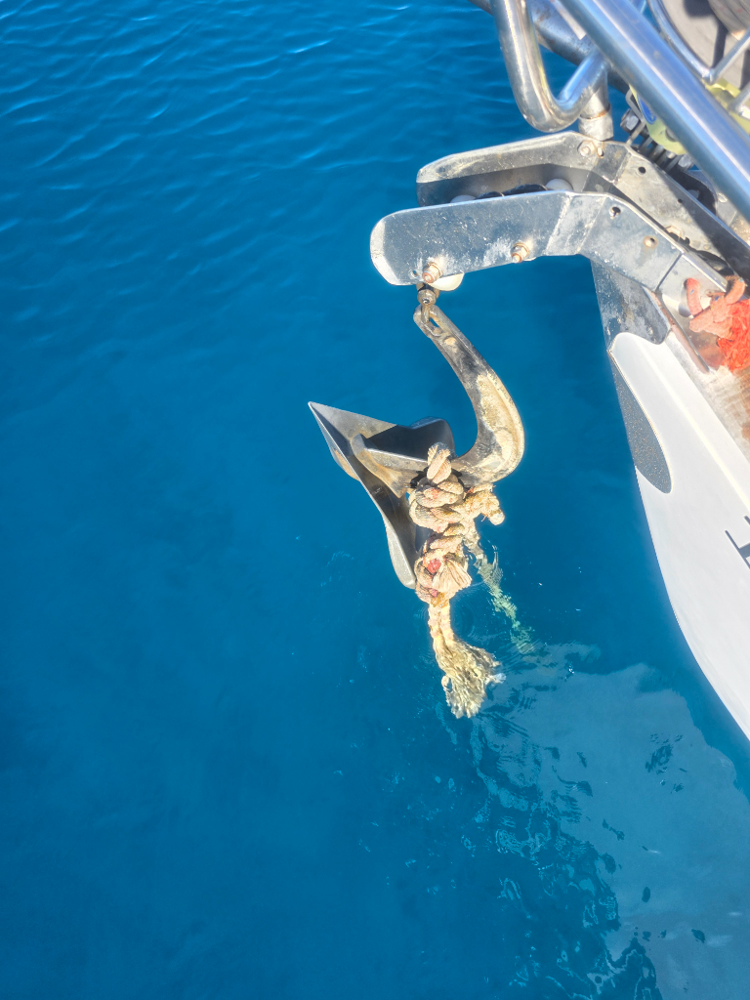
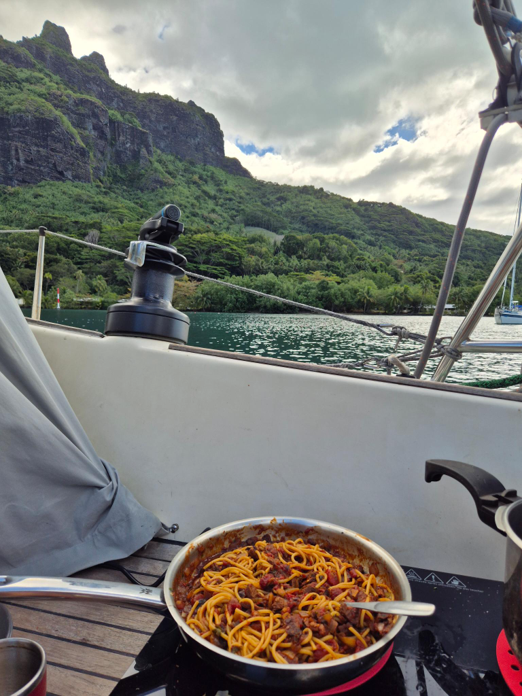

Having done a ton of grocery shopping, it was time to leave industrial Tahiti behind. We knew our anchor was stuck on an old mooring, and so we chose a calm morning to detach. Luckily the mooring rope was long enough to reach the surface. We had friends ready to dive for us, but that wasn't necessary.

After the anchor had been cleared, we radioed Papeete Port Control, and were told to again proceed to near the runway and hold position. A moment later an airplane took off and we were given clearance to cross.

The trip to Mo'orea was a quick motoring hop in zero winds. There was a relatively big swell, but that wasn't a problem.

Now we're anchored in the deep Pao Pao Bay (also known as Cook's Bay), surrounded by impressive mountains reminiscent of Fatu Hiva. We have 85m of chain out! Since the battery was full, we tried our new induction stove for the first time in the cockpit. 

* Distance today: 19.7NM
* Lunch: spaghetti bolognese
* Engine hours: 4.8
