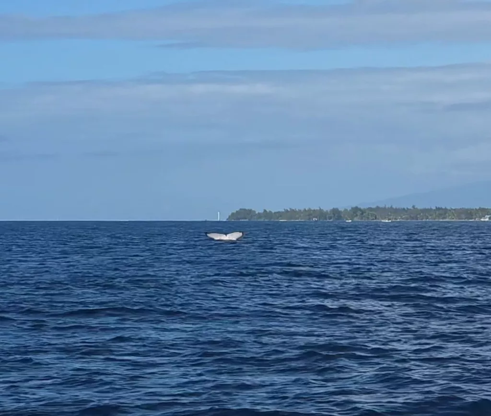
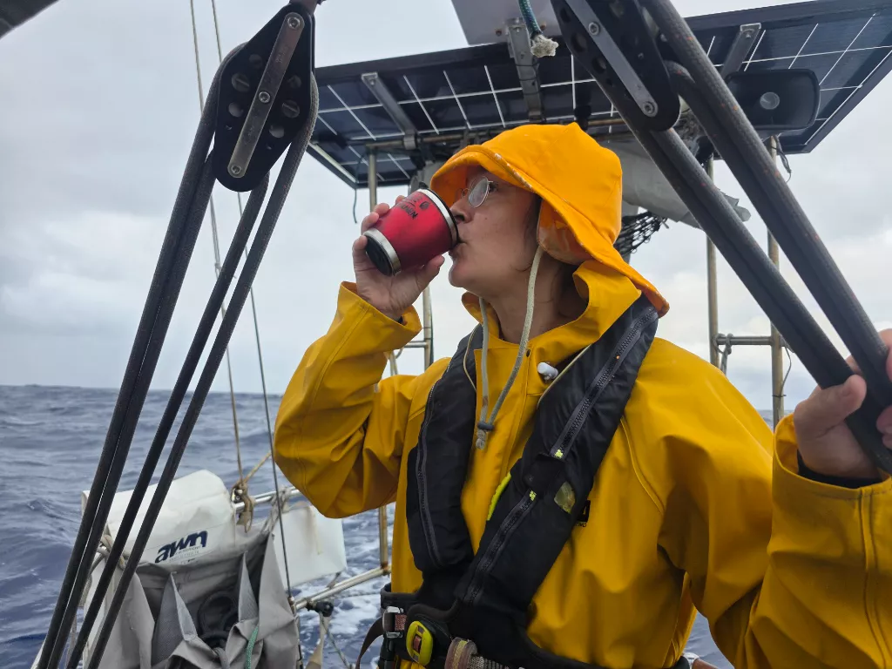

It was quite the workout to raise the anchor from 20 meters deep. But with both of us pulling we managed without our rope to the winch backup plan. Inside the bay we hoisted the mainsail and motored out. Just as we were in deeper water, a pod of humpback whales greeted us. What a majestic sight!

As the darkness fell, we changed to staysail and few hours later put in a reef to the main. The night was rainy and fast. The waves were tossing us around and neither of us got much sleep. In the dawn between the rainclouds the green peaks of Huahine became visible. That is also when the rain stole all of the wind and we turned on the engine. A while later, we motored through the pass and dropped anchor in a refreshing 5 meter depth!  

* Distance today: 92.4NM
* Lunch: Coconut Lentil Curry
* Engine hours: 3.3
