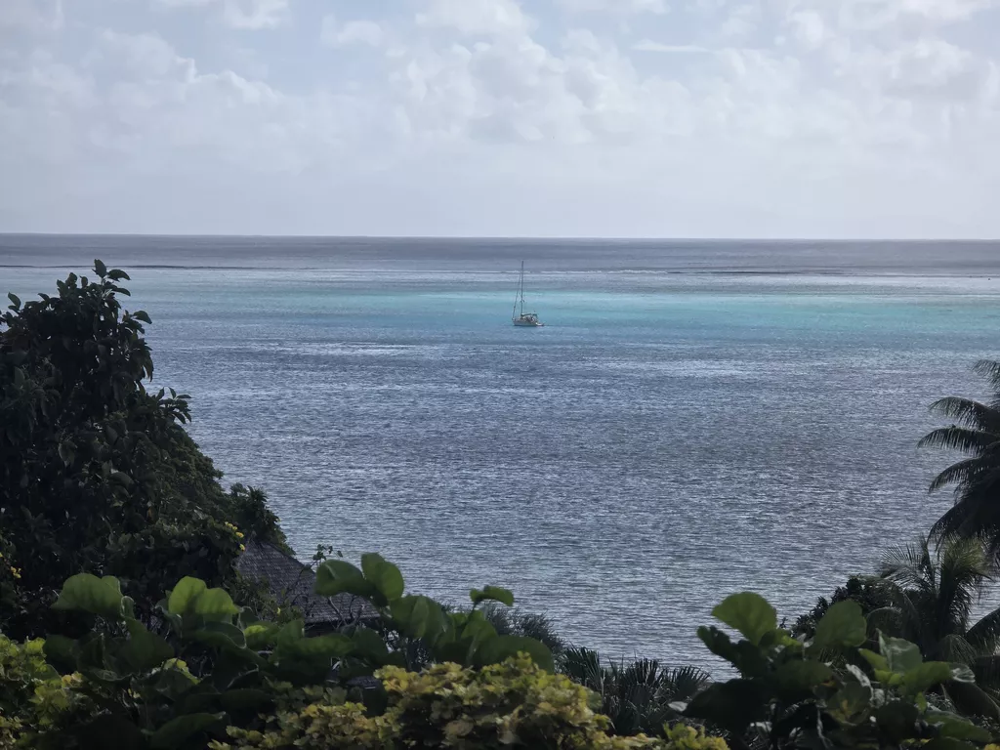

While we have been waiting for weather for the passage to Cook Islands, we've utilized the time building backup communication systems. Starlink changes their policies on August 17th, and it is possible it becomes prohibitively expensive for us.

And so now we [have tools](https://www.npmjs.com/package/@meri-imperiumi/signalk-offshore-blogging) to publish blog posts and request GRIB weather data over both InReach satellite connection and amateur HF radio. This post is our first test using them. While at sea, photos will be of lower quality, and replaced with high res when we have faster internet again.

