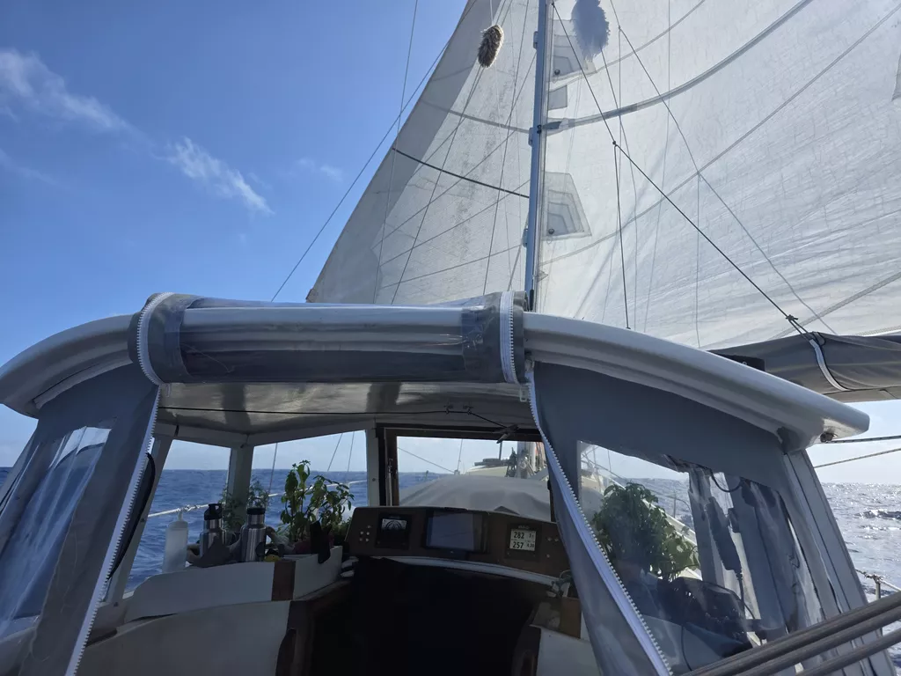

We hoisted anchor just before sunrise. Swell outside had settled a bit, and so it was finally time to leave French Polynesia behind.

As soon as we rigged up the spinnaker pole, we realized this is the first downwind leg since probably the trip to Nuku Hiva!

Passing Ra'iātea, we were hailed by Tahiti JRCC. They were having trouble contacting a vessel, and wanted to do a radio check. We had a brief conversation and exchanged DSC messages successfully both ways. First DSC since radio exam back in Berlin!

* Distance today: 54NM
* Lunch: pea soup
* Engine hours: 0.9
