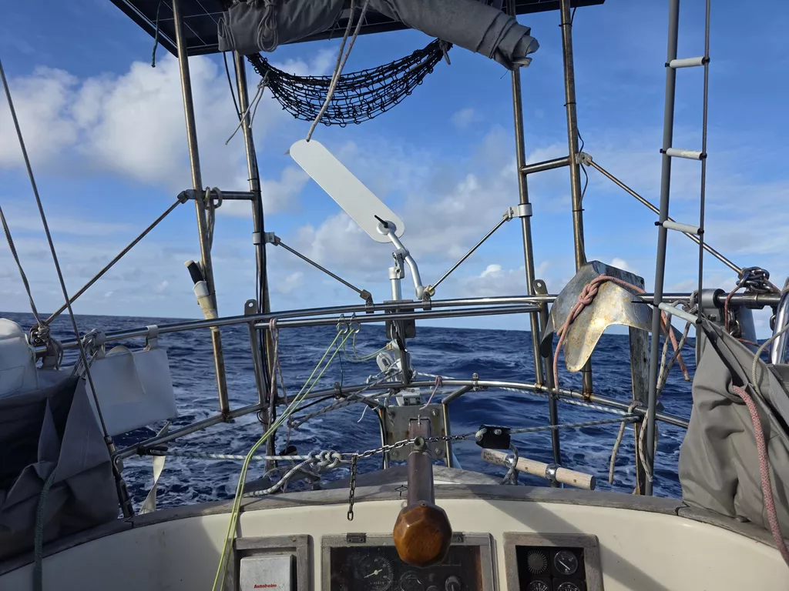

The wind quieted down for the night, meaning that we had to spend the dark hours with occasionally slatting sails and struggling windvane. But at least we had a good showing of shooting stars to accompany us.

It seems we truly left our sea legs into the smooth waters of the atolls. Suski is still working to adjust, and feeling the effects of the motion in the seastate.

By afternoon the wind was back, and we're making good progress westward.

* Distance today: 110NM
* Lunch: spaghetti aglio e olio
* Engine hours: 0
