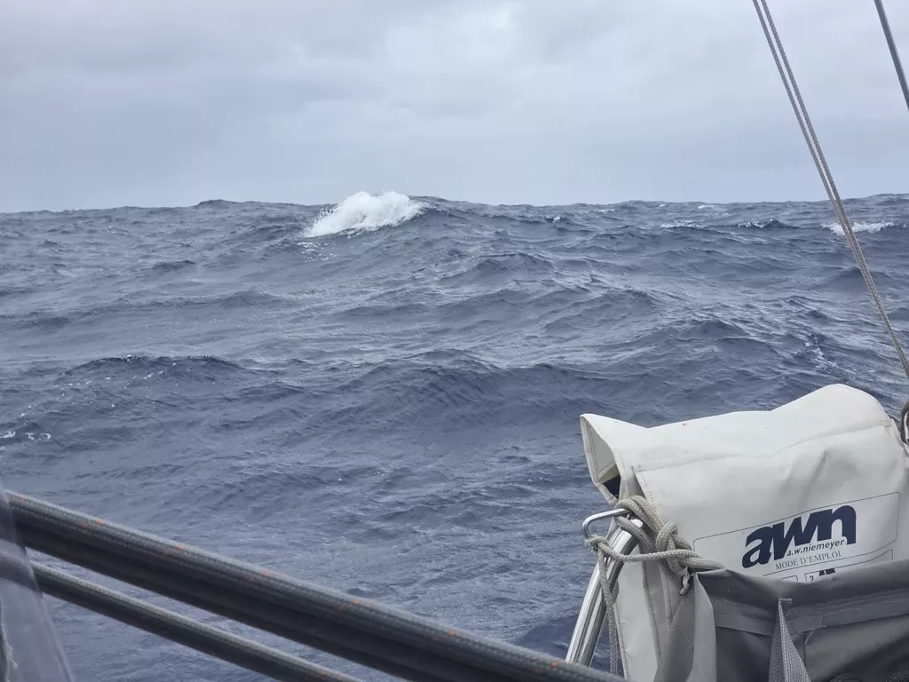

Wind did indeed come back. We entered the night with the main in the first reef, and by morning had switched to 2nd reef and staysail.

Seas have been somewhat lumpy and weather squally. But despite that we finished today with higher battery level than yesterday, thanks to the hydrogenerator. 

Today has also seen a very slow motion chase scene, as a 14m sailboat has spent the last 20 hours slowly passing us and pulling ahead. Apart from that and a tanker going the other way there hasn't been any traffic. A lot of boats took this weather window to Cook Islands, but most started from further north in Bora Bora.

* Distance today: 137NM
* Lunch: chanterelle risotto
* Engine hours: 0
