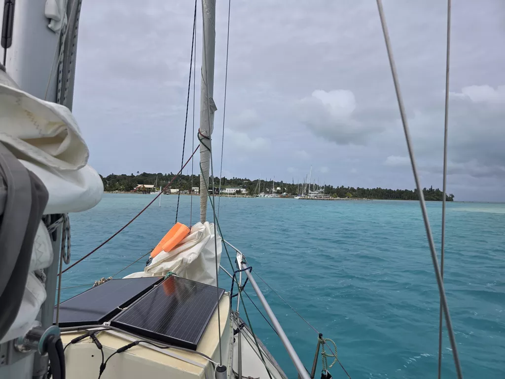
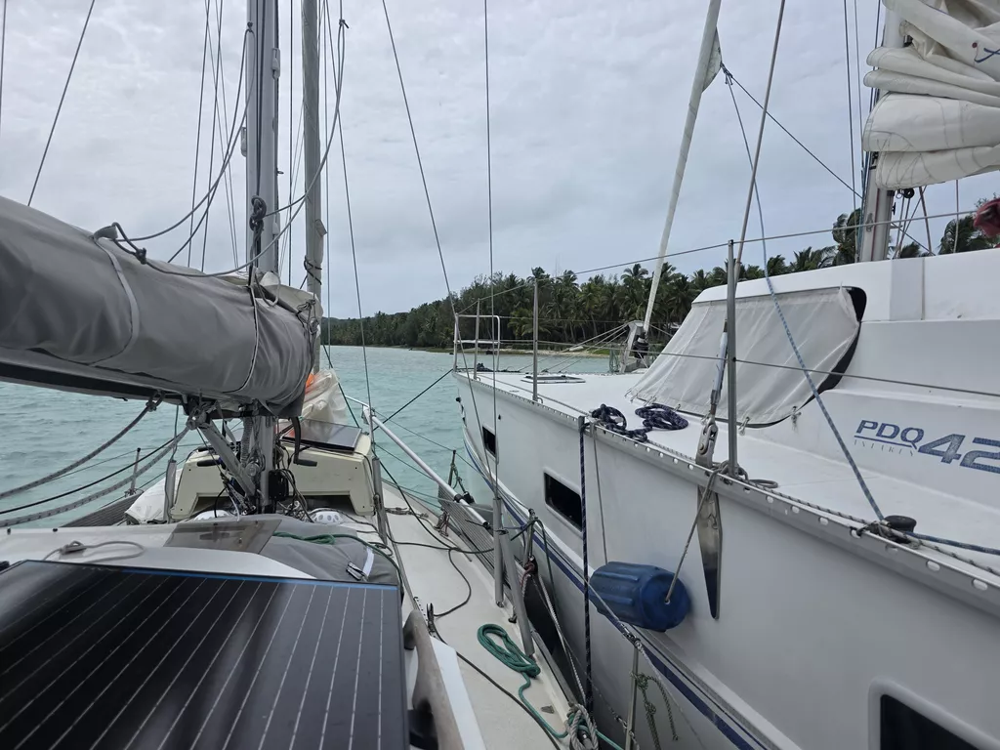

Before the sun set, we changed to starboard tack. At first it meant that we were going slightly too much north, but as per the forecast, the wind slowly backed towards north and we could point straight towards Aitutaki.

The Arutanga harbour is tiny and under construction, the comings and goings are organized through the Aitutaki Welcome Commitee WhatsApp group. As we were coming in, we checked the group and we were instructed to go and side tie to a catamaran. The pass to the harbour is an artificial one and shallow and narrow. We got in without an issue and even our first harbour manouver since Shelter Bay in Panama went without issues! Now we need to clear biosecurity, health check, customs and immigration.

* Distance today: 105NM
* Lunch: fish&chips
* Engine hours: 0.5
