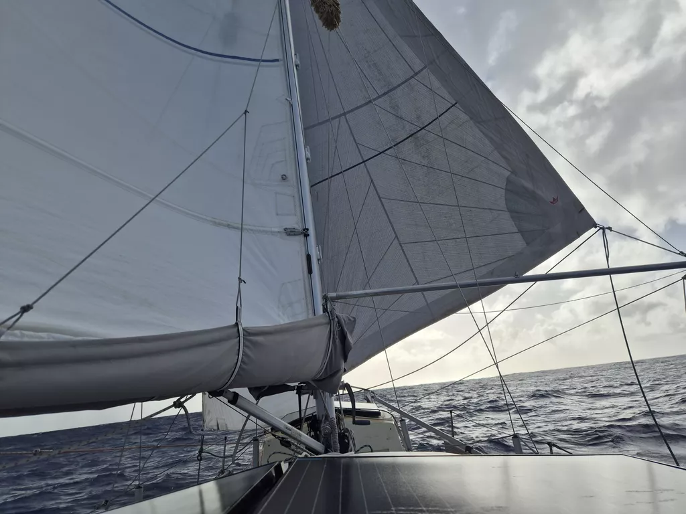

In the morning it was time to undo the spiderweb of anchors, land lines and springs between the boats. In about an hour, we were ready to go. We got the privilige of going first, followed by *Sea Ya*, *Tirohanga* and *2Easy*.In about half an hour, we had all taken our slightly different courses and all the other sails disappeared between the waves.  

The sea state is still quite big after the storm, currently around 3 meters, but it should ease quickly now. We are sailing into weakening wind expecting to punch through a patch of windstill tomorrow. 

* Distance today: 41NM
* Lunch: Lentil-coconut-soup
* Engine hours: 0.5
