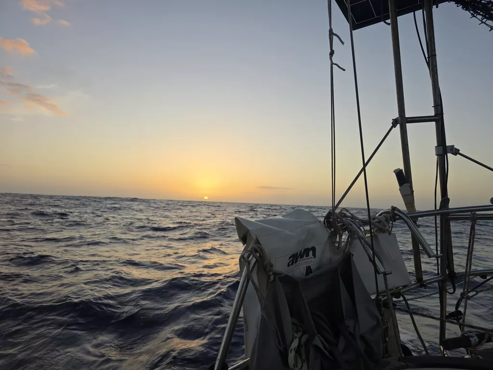
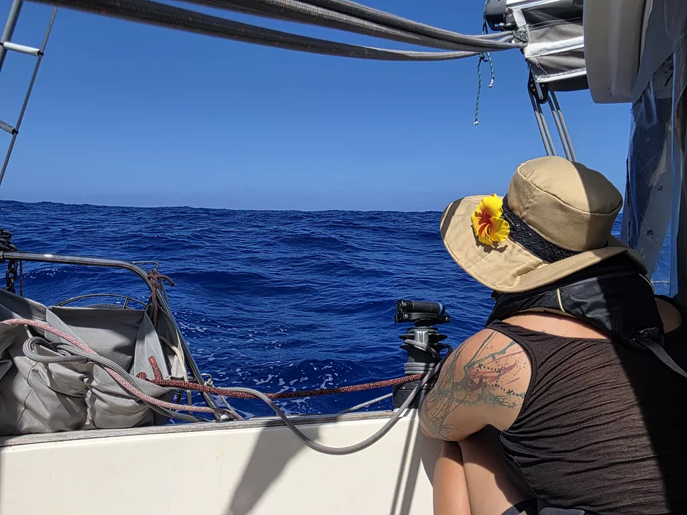

Wind started reducing over night, making for a bit of struggle with slatting sails and windvane that didn't quite get enough input from the apparent wind. But as our electric autopilot has been out of order, we kept correcting the windvane whenever it drifted off course. Sometimes every few minutes, and sometimes hours would pass without intervention.

In the morning we decided to try fixing the autopilot, and were able to do so. The deck plug is still a bit fiddly and will need replacement. But at least now we have a solution for light airs.

Today's expected entertainment was the [re-entry of an ESA satellite](https://blogs.esa.int/rocketscience/2026/08/24/final-cluster-reentries-31-aug-1-sept-2026/), Samba. ESA had asked cruisers to try and capture video of it, but sadly we were either too far north, or the noon sun too bright to see anything. We'll try again with the Tango satellite tomorrow.

In the afternoon wind finally reached the threshold where we couldn't sail, and so we are now motoring directly towards Niue. Wind should pick up as we pass the Palmerston atoll.

* Distance today: 105NM
* Lunch: spaghetti aglio e olio
* Engine hours: 1.5
