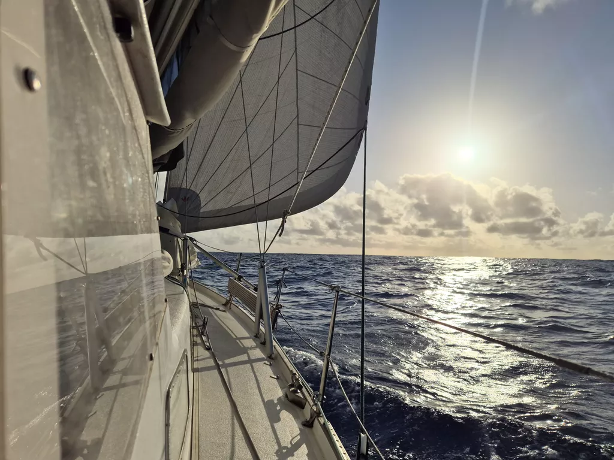

In the darkening evening Suski took a look at the bilge. Under the engine in the oil pan a unwanted sight when the motor is running. Oil. Not much, maybe few tablespoons but nevertheless alarming as our engine has never before had any under it. So we stopped the engine and did initial observations and let the engine cool before trying more properly to figure out the source. So over the night we sailed with next to no wind. The electronic autopilot kept us on track, though going dirrctly downwind was now out of question, we needed at least some apparent wind to keep the sails filled. 

After sunrise the engine got a second inspection. The oil had come around the dip stick, so most likely due to the not so gentle sea state. We will keep monitoring it and keep our motoring time at minimum for the time being.

Then few hours later, the electric autopilot broke, again. This time to a mechanical failure as the tiller arm went limp. Well fuck. Luckily by this point the wind picked up a bit and the WindPilot could hold a course once more. We opened up the tiller arm and found a shear pin in 3 pieces. Not good. We devised a shear pin from a piece of stainless split ring and put the tiller arm back together again with great difficulty. Loose ball bearings is not what you want to be messing with in a rocking boat. Few got lost in the process, but now the tiller arm works again. Though sounding rougher that it used to, so a replacement will be procured at our earliest convenience.

After all of this Suski got to sea watch with not much sleep but Lille Ø was steadily moving us directly to our target, so the sea watch became a series of quick naps between lookouts.

* Distance today: 80NM
* Lunch: Shaksuka
* Engine hours: 0
