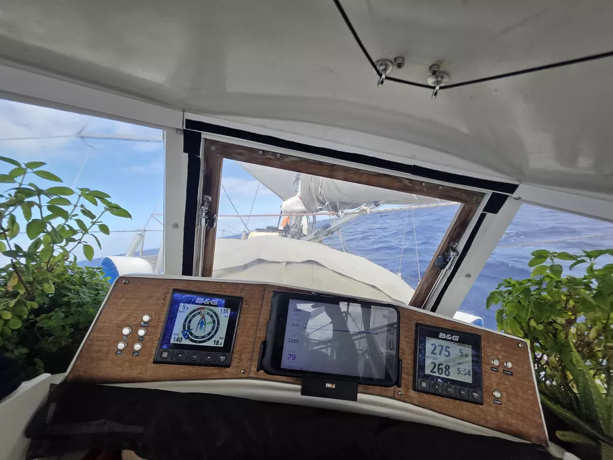

Having gotten through the calms, we were rewarded with almost 24h of the best kind of ocean sailing: wind 13-15kn on the stern quarter, nice waves, and a beautiful sunny blue sea.

Around noon watch change the wind started picking up, and we switched directly to staysail and main in the 2nd reef. The forecast has blustery conditions for the night and so it is better to be prepared.

Today's meal was chanterelle risotto, made from what I believe are the last batch of what we picked in Finland in 2023.

* Distance today: 134NM
* Lunch: chanterelle risotto
* Engine hours: 0
