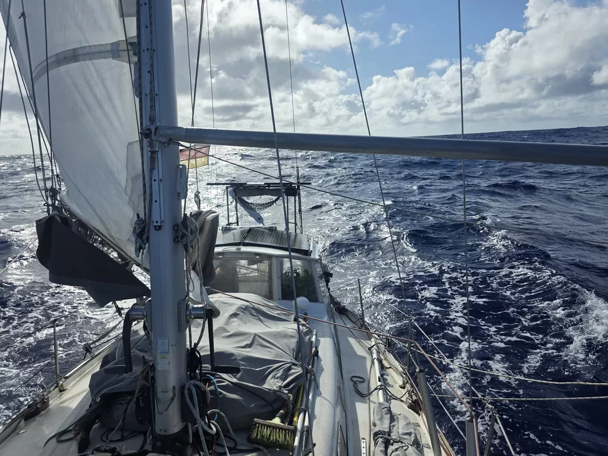

The night started quite rough, with a series of 32kn gusts rolling over the boat. As we had reefed down early, dealing with them meant just doing a slight weather helm correction on the windvane, and then zipping down the dodger backdrop. Such luxury to stay dry in conditions like this!

By midnight the worst was over. Around 3am the off-watch was roused for a happier occasion: we had just crossed W166°48'24" of longitude, which happens to be the antimeridian of our home port in Berlin. Now all Nautical Miles sailed will be closer to home.

Quite pleasant sailing conditions followed. Wind in the teens and slowly decreasing sea state. Some moments of lull brought slatting sails, and we hope that there's enough wind until Niue.

* Distance today: 140NM
* Lunch: pea soup
* Engine hours: 0
