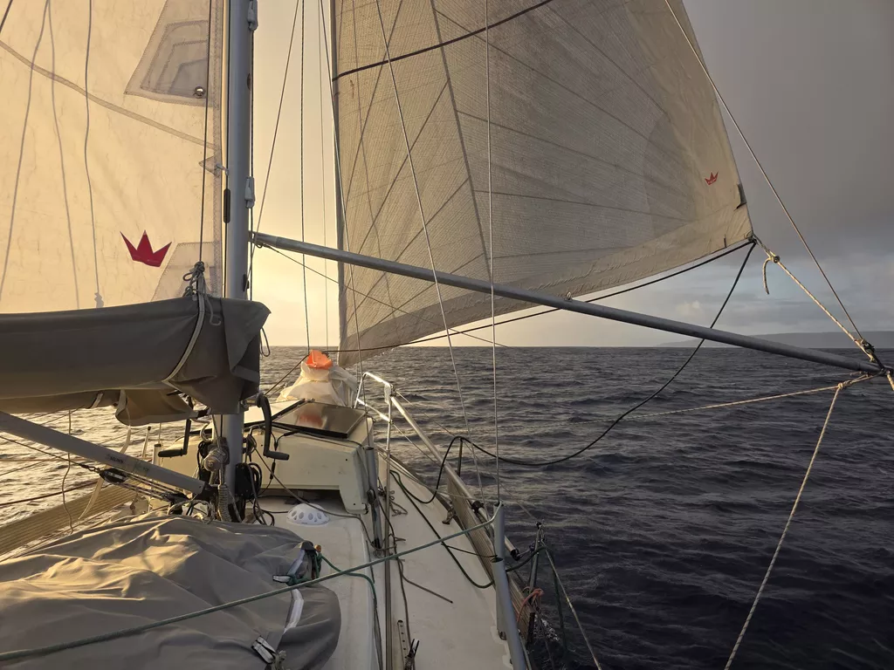

Good sailing conditions prevailed until the morning, but then we were back to low winds and slatting sails.

Instead of motoring the rest of the way, we chose to gybe our way towards Niue, trying to play with the currents in order to find the more favorable tack.

In the afternoon the wind picked up again and we were able to point more or less to our destination. But the time lost in light winds meant arrival after sunset. Luckily the mooring balls at Niue are well marked and easy to find. Now we can enjoy an anleger of a German Krombacher beer to mark the halfway point. 

* Distance today: 119NM
* Lunch: potato parmesan bracioles
* Engine hours: 0.5
