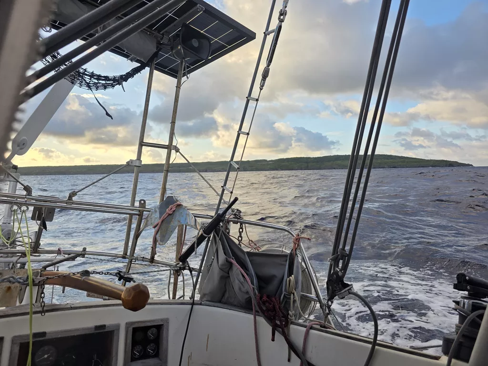

As expected, in the night the wind had veered to NW and was supposed to turn to southerly winds through west over the day. That meant that it was time to go. With any westerly components in the wind Niue mooring field is completely unprotected and the waves will become dangerously big quite quickly. So at first light we dropped the mooring lines and motored past the other boats to set sails and head out. With staysail and first reef we ventured out. The expected wind turn was supposed to come as a front. As we saw the row of dark grey rainclouds approaching, we put in a second reef, just in case. 

The front passed and the wind turned, so we tacked and continued our sail, again with first reef, now actually pointing towards the northern corner of Tonga. The sea state was quite confused during the wind shift, but soon we could continue with wind and waves on the beam.

* Distance today: 39NM
* Lunch: pomodoro pasta
* Engine hours: 0.05
