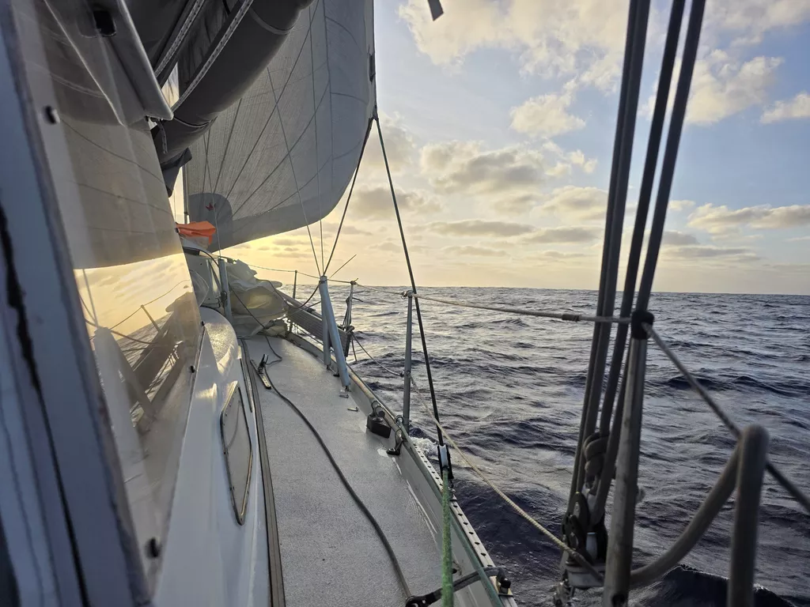

Overnight the wave train settled to the new wind direction, and the cloudy conditions dissipated. As result, we enjoyed quite a smooth ride under a starlit sky.

Winds are light making for slow going. But if conditions stay this smooth, what's an extra day at sea?

In the morning hours we were passed by catamaran *O2*, and the whole day the Polish vessel *Matilda* has been creeping closer.

* Distance today: 100NM
* Lunch: quinoa salad
* Engine hours: 0
