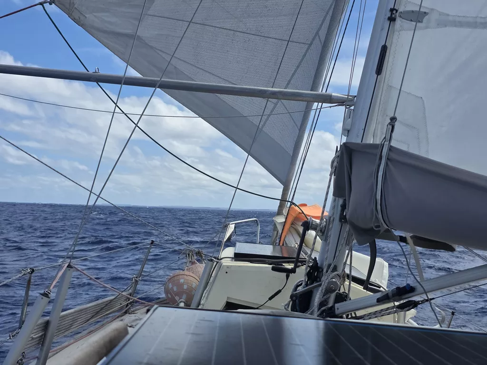
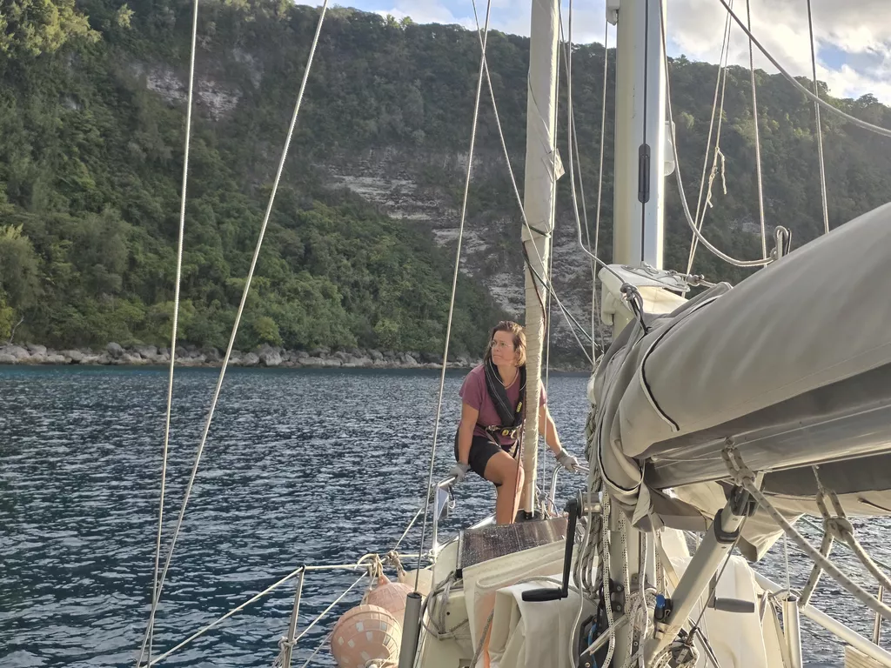

In the darkness we crossed over the Tonga Trench, the second deepest trench in the world! Few hours later, at midnight, it was time to change the ship's clock. From Saturday 12th of September straight to Monday 14th of September. From UTC -11 to UTC +13. A day lost to the abyss. Yet another milestone on this trip!

At dawn Swiss catamaran *Raija* flew past us. Around midday the wind picked up enough to require 1st reef on the main and genoa rolled in about 30%. That also meant that finally we had enough wind to go wing on wing, so we adjusted our course to pass Vava'u from the north as it became clear we cannot make it to Neiafu during daylight hours. After turning the northern corner we could enjoy sailing in flat seas and good wind! We dropped the hook in 15 meters of water. We'll continue to Neifu tomorrow after a good night's sleep.

* Distance today: 114NM
* Lunch: tomato cashew pasta
* Engine hours: 0.9
