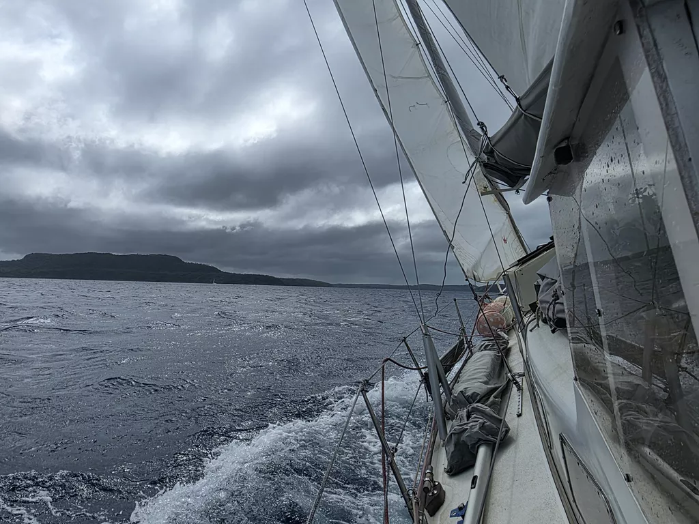

After a night well slept, we hoisted anchor at sunrise. Always a big effort at these depths! Then we started ghosting along following the steep shoreline. At the lee of Vava'u, the winds were fickle and progress slow. But we were rewarded by two whales surfacing close to the boat.

Once we got to the channel leading to the inner archipelago, wind picked up. What followed was a fun brisk upwind sail amid the small islands. This will be a great cruising ground once we're cleared in!

The Outremer rally was leaving Tonga as we sailed in. We had a brief radio conversation with the Finnish boat *No Regrets*. We'll meet them later in New Zealand.

As there is a supply ship at the customs dock, we and the other incoming boats were told to anchor outside. Biosecurity and Health & Safety came onboard as soon as we had the anchor down, but we still wait for Customs and Immigration.

* Distance today: 12NM
* Lunch: not yet
* Engine hours: 0.9
