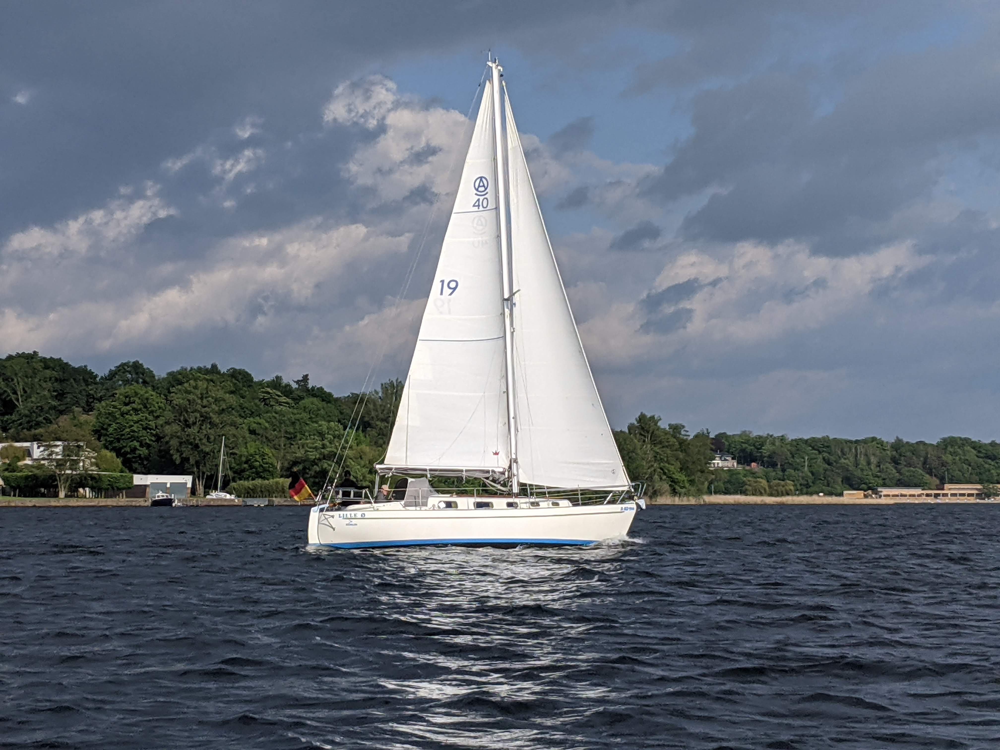
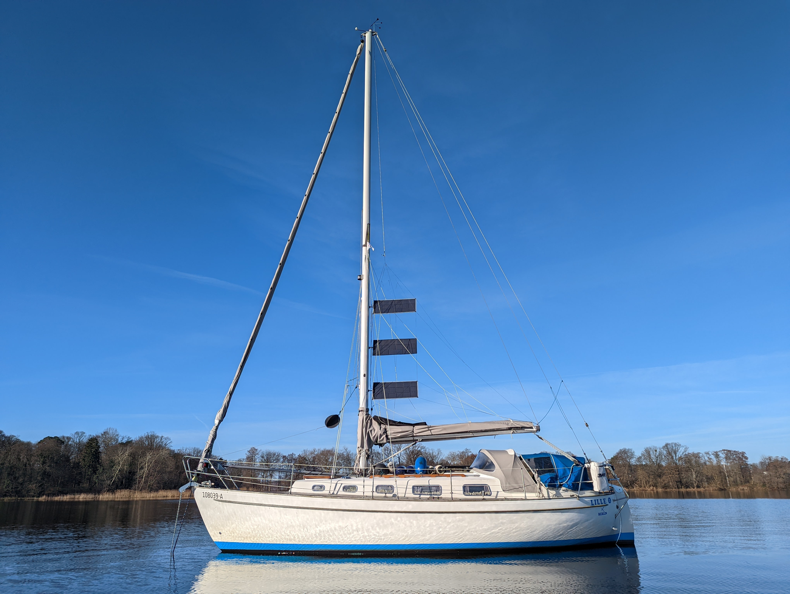

Lille Ø is an [Amigo 40](https://sailboatdata.com/sailboat/amigo-40), a 31ft heavy displacement full-keel "spitzgatter" (canoe stern with transom-hung rudder) built in Sweden in 1979. It was the boatyard's exhibition boat in the Hamburg boat show, and was bought from there to Berlin. We're the fourth owners, having bought the boat in 2021.

 

[See our stats on Saillogger](https://saillogger.com/stats/143/)

## In numbers

* MMSI: [211692440](https://www.marinetraffic.com/en/ais/details/ships/shipid:6684115/mmsi:211692440/imo:0/vessel:LILLE_OE)
* Length: 9.36m
* Beam: 3.05m
* Draft: 1.55m
* Air draft: 13.37m
* Displacement: 6400kg
* Hull speed: 6.9kt
* Sail area: 40m2
* Engine: 27hp Yanmar 3GM30F 
* Dinghy: 2.6m [Banana-boot](http://www.banana-boot.de/en/) folding hard dinghy
* 200l freshwater tank
* 79l diesel tank

## Sail inventory

* 21m2 full battened main sail with two reefing points
* 19m2 roller furling working jib
* 68m2 [Parasailor](https://www.parasailor.com/) downwind sail

## Energy

* 5kWh of Victron LiFePO4 batteries
* 510W of solar panels
  - 150W fixed panel on the stern arch
  - 60W fixed panel on cabin top
  - 300W [FLINsail](https://flin-solar.com/flinsail) that can be hoisted up the mast when anchored
* 80A alternator on the Diesel engine
* 12V system monitored by [Victron VRM](https://www.victronenergy.com/panel-systems-remote-monitoring/vrm)

## Ground tackle

* 15kg Rocna Vulcan with 50m chain as bow anchor
* 15kg Bruce with 5m chain and 45m line as stern anchor
* Fortress Fx-11 kedge anchor

 
